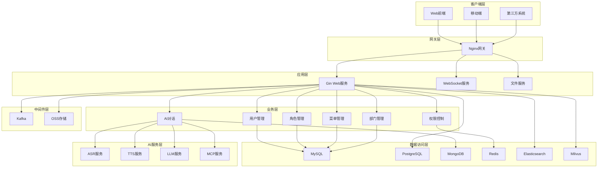
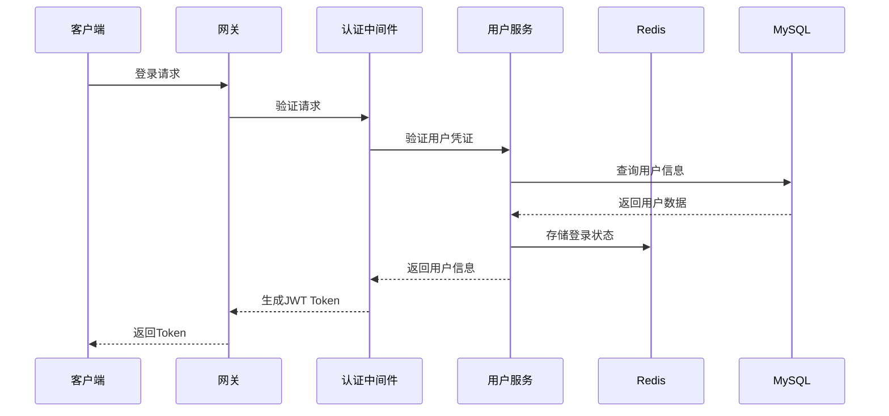
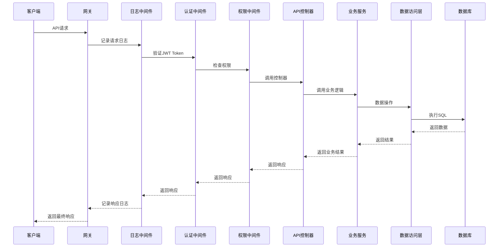
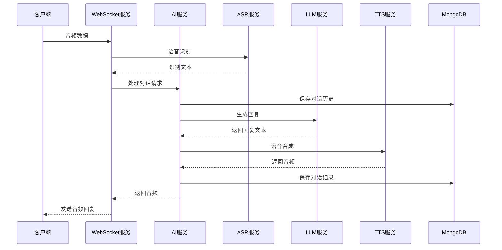

# 项目架构设计

## 1. 整体架构图



## 2. 目录结构说明

### 2.1 项目根目录
```
gin-admin-pro/
├── cmd/                    # 程序入口
│   └── server/
│       └── main.go         # 主程序入口
├── config/                 # 配置文件
│   ├── config.yaml         # 主配置文件
│   ├── config.dev.yaml     # 开发环境配置
│   └── config.prod.yaml    # 生产环境配置
├── internal/               # 内部代码（不对外暴露）
│   ├── api/                # API控制器层
│   │   └── v1/
│   │       └── system/      # 系统管理模块
│   ├── service/            # 业务逻辑层
│   │   └── system/         # 系统管理服务
│   ├── dao/                # 数据访问层
│   │   └── system/         # 系统管理DAO
│   ├── model/              # 数据模型
│   │   └── system/         # 系统管理模型
│   ├── middleware/         # 中间件
│   ├── router/             # 路由配置
│   └── pkg/                # 内部工具包
│       └── config/         # 配置管理
├── plugin/                 # 插件系统
│   ├── redis/              # Redis插件
│   ├── mysql/              # MySQL插件
│   ├── postgresql/         # PostgreSQL插件
│   ├── mongodb/            # MongoDB插件
│   ├── elasticsearch/      # Elasticsearch插件
│   ├── milvus/             # Milvus插件
│   ├── kafka/              # Kafka插件
│   ├── oss/                # 文件存储插件
│   └── ai/                 # AI集成插件
├── docs/                   # 文档目录
│   ├── tech/               # 技术文档
│   │   ├── step/           # 实现步骤记录
│   │   └── api/            # API文档
│   └── sql/                # 数据库脚本
├── scripts/                # 脚本文件
├── test/                   # 测试文件
├── docker/                 # Docker配置
├── go.mod                  # Go模块定义
├── go.sum                  # Go模块依赖锁定
├── Makefile                # 构建脚本
├── README.md               # 项目说明
└── PROGRESS.md             # 进度跟踪
```

### 2.2 详细目录说明

#### cmd/
存放程序入口代码，`cmd/server/main.go`是Web服务的主入口。

#### config/
存放配置文件，支持多环境配置：
- `config.yaml`: 基础配置模板
- `config.dev.yaml`: 开发环境专用配置
- `config.prod.yaml`: 生产环境专用配置

#### internal/
项目核心代码，包含所有业务逻辑：

##### api/
API控制器层，处理HTTP请求：
- `api/v1/system/`: 系统管理模块的API
  - `user.go`: 用户管理API
  - `role.go`: 角色管理API
  - `menu.go`: 菜单管理API
  - `dept.go`: 部门管理API
  - `auth.go`: 认证相关API

##### service/
业务逻辑层，处理核心业务逻辑：
- `service/system/`: 系统管理服务
  - `user.go`: 用户管理业务逻辑
  - `role.go`: 角色管理业务逻辑
  - `menu.go`: 菜单管理业务逻辑
  - `dept.go`: 部门管理业务逻辑

##### dao/
数据访问层，负责数据库操作：
- `dao/system/`: 系统管理数据访问
  - `user.go`: 用户数据访问
  - `role.go`: 角色数据访问
  - `menu.go`: 菜单数据访问
  - `dept.go`: 部门数据访问

##### model/
数据模型定义：
- `model/system/`: 系统管理模型
  - `user.go`: 用户模型
  - `role.go`: 角色模型
  - `menu.go`: 菜单模型
  - `dept.go`: 部门模型
  - `base.go`: 基础模型定义

##### middleware/
中间件实现：
- `logger.go`: 日志中间件
- `cors.go`: 跨域中间件
- `auth.go`: 认证中间件
- `permission.go`: 权限中间件
- `rate_limit.go`: 限流中间件
- `recovery.go`: 异常恢复中间件

##### router/
路由配置：
- `router.go`: 主路由配置
- `system.go`: 系统管理路由

##### pkg/
内部工具包：
- `config/`: 配置管理
- `response/`: 统一响应格式
- `pagination/`: 分页工具
- `security/`: 安全相关工具

#### plugin/
插件系统，各数据库和服务的插件化实现：

##### database/
数据库插件：
- `mysql/`: MySQL数据库插件
- `postgresql/`: PostgreSQL数据库插件
- `mongodb/`: MongoDB文档数据库插件
- `redis/`: Redis缓存插件
- `elasticsearch/`: Elasticsearch搜索引擎插件
- `milvus/`: Milvus向量数据库插件

##### middleware/
中间件插件：
- `kafka/`: Kafka消息队列插件
- `oss/`: 对象存储插件

##### ai/
AI集成插件：
- `ai/`: AI服务集成
- `mcp/`: MCP协议实现

#### docs/
文档目录：
- `tech/`: 技术文档
- `sql/`: 数据库脚本
- `api/`: API文档

## 3. 模块划分

### 3.1 系统管理模块
负责用户、角色、菜单、部门等系统基础功能的管理。

#### 用户管理 (User Management)
- 用户CRUD操作
- 用户密码管理
- 用户状态管理
- 用户权限分配

#### 角色管理 (Role Management)
- 角色CRUD操作
- 角色权限分配
- 数据权限配置
- 角色菜单权限

#### 菜单管理 (Menu Management)
- 菜单CRUD操作
- 菜单树形结构
- 菜单权限控制
- 动态路由生成

#### 部门管理 (Department Management)
- 部门CRUD操作
- 部门树形结构
- 部门用户管理
- 数据权限范围

### 3.2 AI集成模块
负责AI对话、语音处理等AI相关功能。

#### 对话管理 (Conversation)
- 对话流程控制
- 对话历史管理
- 多模式对话支持
- 会话状态管理

#### 语音处理 (Voice Processing)
- ASR语音识别
- TTS语音合成
- 音频格式转换
- 实时音频处理

#### AI服务管理 (AI Service)
- AI提供商管理
- 模型配置管理
- 服务连接池
- 服务健康检查

### 3.3 权限控制模块
负责系统的认证和授权。

#### 认证 (Authentication)
- JWT令牌管理
- 用户登录/登出
- 令牌刷新机制
- 多点登录控制

#### 授权 (Authorization)
- RBAC权限模型
- 接口权限控制
- 数据权限控制
- 动态权限检查

### 3.4 基础设施模块
负责基础功能支撑。

#### 配置管理 (Configuration)
- 多环境配置
- 配置热加载
- 配置验证
- 配置加密

#### 日志管理 (Logging)
- 结构化日志
- 日志分级
- 日志轮转
- 日志收集

#### 缓存管理 (Caching)
- Redis缓存
- 本地缓存
- 缓存策略
- 缓存预热

#### 文件管理 (File Management)
- 文件上传
- 文件存储
- 文件访问
- 文件类型管理

## 4. 数据流设计

### 4.1 用户登录流程


### 4.2 API请求流程


### 4.3 AI对话流程


## 5. 技术架构特点

### 5.1 分层架构
- **表现层**: API接口、WebSocket接口
- **业务层**: 业务逻辑、服务编排
- **数据层**: 数据访问、缓存管理
- **基础设施层**: 配置、日志、监控

### 5.2 插件化设计
- **数据库插件**: 支持多种数据库，可插拔切换
- **中间件插件**: 支持多种中间件，灵活组合
- **AI插件**: 支持多种AI服务，易于扩展

### 5.3 微服务架构准备
- **模块化设计**: 各模块低耦合、高内聚
- **接口标准化**: 统一的接口规范和响应格式
- **配置中心化**: 统一配置管理，支持动态更新
- **服务发现**: 为后续微服务化做好准备

### 5.4 高可用设计
- **无状态设计**: 服务节点可水平扩展
- **数据库集群**: 支持主从复制、读写分离
- **缓存集群**: Redis集群部署
- **负载均衡**: 支持多实例部署

### 5.5 安全设计
- **JWT认证**: 无状态令牌认证
- **RBAC权限**: 基于角色的访问控制
- **数据权限**: 细粒度的数据访问控制
- **API安全**: 接口限流、参数验证

## 6. 扩展性设计

### 6.1 水平扩展
- **Web服务**: 支持多实例部署
- **数据库**: 支持读写分离、分库分表
- **缓存**: 支持分布式缓存
- **存储**: 支持分布式对象存储

### 6.2 功能扩展
- **插件机制**: 新功能通过插件方式集成
- **配置驱动**: 通过配置快速开启/关闭功能
- **API版本**: 支持API版本管理
- **模块化**: 新模块可独立开发和部署

### 6.3 技术栈扩展
- **数据库**: 可轻松接入新的数据库类型
- **AI服务**: 可集成更多AI提供商
- **中间件**: 支持新的消息队列、搜索等
- **协议**: 支持更多通信协议（MQTT、gRPC等）